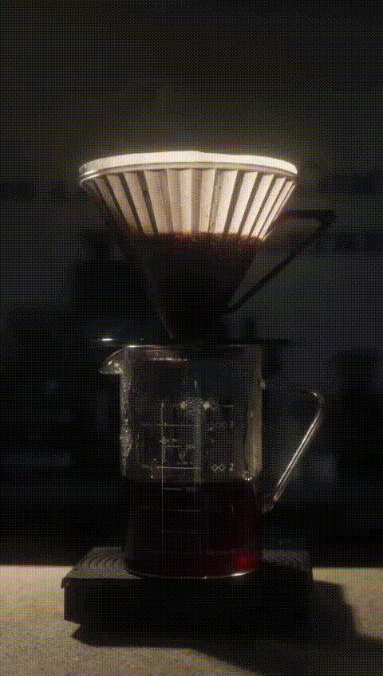
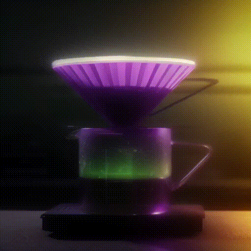
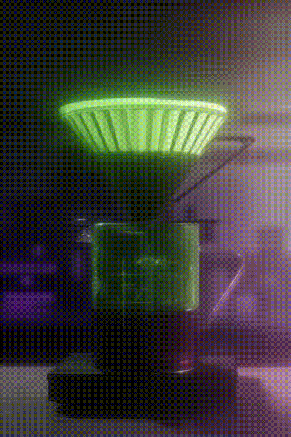
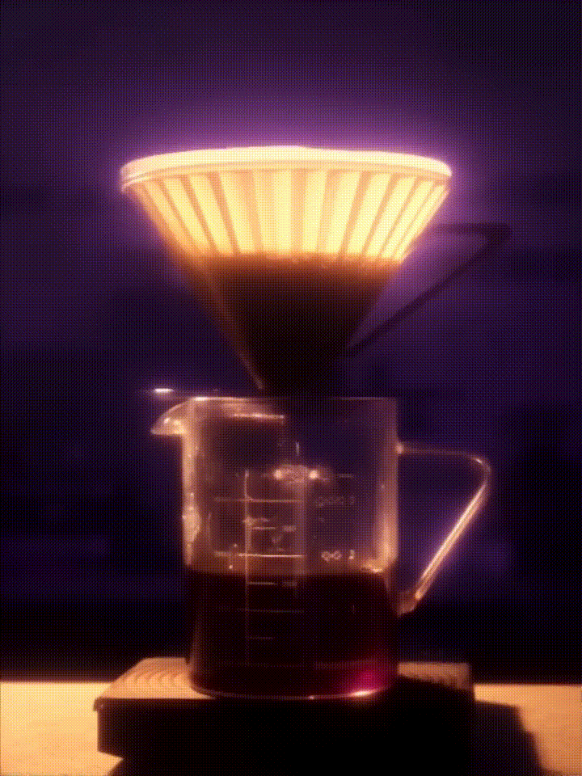
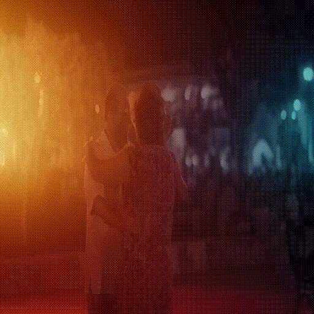

## 💡 Demo
# ‼️Gifs have poor quality and may look laggy in the anonymised link. ‼️

# 🎃A visual comparison among the baselines.

## Relight Prompt: "Green and purple aurora light."
## Direction: Right
<table>
  <tr>
    <td align="center"><b>Input Video</b></td>
    <td align="center"><b>Hi-Light (ours)</b></td>
    <td align="center"><b>LAV(AnimateDiff)</b></td>

  </tr>
  
  </tr>
      <td></td>
      <td></td>
      <td></td>
  </tr>
  
  <tr>
    <td align="center"><b>LAV(CogVideoX)</b></td>
    <td align="center"><b>LAV(Wan)</b></td>
    <td align="center"><b>TC-Light</b></td>
  </tr>
  
  <tr>
    <td></td>
    <td></td>
    <td></td>
  </tr>
  
</table>

## Relight Prompt: "Warm orange light."
## Direction: Left

<table>
  <tr>
    <td align="center"><b>Input Video</b></td>
    <td align="center"><b>Hi-Light (ours)</b></td>
    <td align="center"><b>LAV(AnimateDiff)</b></td>

  </tr>
  
  </tr>
      <td></td>
      <td></td>
      <td></td>
  </tr>
  
  <tr>
    <td align="center"><b>LAV(CogVideoX)</b></td>
    <td align="center"><b>LAV(Wan)</b></td>
    <td align="center"><b>TC-Light</b></td>
  </tr>
  
  <tr>
    <td></td>
    <td></td>
    <td></td>
  </tr>
  
</table>

# 🎃Demonstration of direction-controlled relighting.

## Relight Prompt: "Torch flame light"

<table class="center">
    <tr>
      <td><p style="text-align: center">Left</p></td>
      <td><p style="text-align: center">Right</p></td>
    </tr>
    <tr>
      <td></td>
      <td></td>
    </tr>
    <tr>
      <td><p style="text-align: center">Top</p></td>
      <td><p style="text-align: center">Bottom</p></td>
    </tr>
    <tr>
      <td></td>
      <td></td>
    </tr>

</table>


# 🎃High camera motion speed relighting demonstration.

<table class="center">
    <tr>
      <td><p style="text-align: center">Demo 1</p></td>
      <td><p style="text-align: center">Demo 2</p></td>
    </tr>
    <tr>
      <td></td>
      <td></td>
    </tr>
    <tr>
    </tr>
</table>


### Original Demo videos can be found in the supplementary material.‼️
<div align="center">

[![]](https://github.com/user-attachments/assets/becdc6bb-5238-4817-84e3-5b90f7a7313c)

</div>

<table class="center">
    <tr>
      <td><p style="text-align: center">Demo 1</p></td>
      <td><p style="text-align: center">Demo 2</p></td>
    </tr>
    <tr>
      <td></td>
      <td></td>
    </tr>
    <tr>
      <td><p style="text-align: center">Input video</p></td>
      <td><p style="text-align: center">Sunset lighting over sea</p></td>
    </tr>
    <tr>
      <td></td>
      <td></td>
    </tr>
    <tr>
      <td><p style="text-align: center">Input video </p></td>
      <td><p style="text-align: center">Green aurora lighting</p></td>
    </tr>
    <tr>
      <td></td>
      <td></td>
    </tr>
</table>

## Installation
We used Python=3.10.16
```bash
git clone "THIS REPO"
cd Relight_Video

conda create -n HiLight python=3.10
conda activate HiLight

pip install -r requirements.txt
```

##  Quick Start
## Input Video specification

The framework supports the Wan2.1 and CogVideoX diffusion backbones, supporting frame numbers of 49 and 81 (theoretically supports 8n+1 frames).

Ensure the video has a resolution >= 480p.

### 1. To split a long video into video segments of the desired number of frames and fps

```bash
python ./utils/split_long_video.py --input_video_path './demo/man_taking_notes.mp4' \
--output_folder './input/81frames_24fps/' \
 --frames_per_segment 81 \
--target_fps 24
```


### 2. To run the video relighting pipeline: Change the following path to yours and edit the prompts in the yaml configuration file.
```bash

# run the demo script
python run_relight_Beta.py --raw_input_video ./demo/woman_holding_a_coffee_1.mp4 \
--config ./configs/wan_relight/woman_holding_a_coffee.yaml
```
### 3. To evaluate the relit video
```bash
python relit_video_evaluation.py --raw_video_path "Path to your raw input video" --relit_video_path "Path to the relit video"
```


## 📣 Disclaimer

This is the official code of Hi-Light.
The copyrights of some of the demo videos are from community users. 
Feel free to contact us if you would like to remove them.


